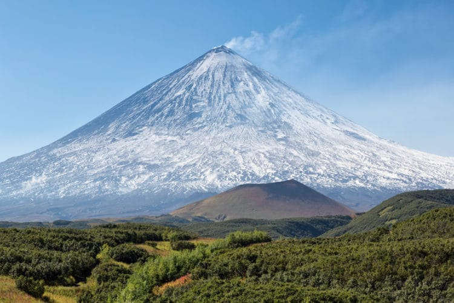

## Мой отпуск

# Байкал

Я живу в городе Иркутск. и у жителей нашей облости, прямо под боком, есть настоящее чудо - Озеро **Байкал**.
Первым делом перед отпуском я бы зарядился энергией байкала, для меня это *Место Силы*

---
# Комчатка

Я хочу посетить комчатку потому что:

1. Долина Гейзеров

2. Вулкан Ключевская сопка

3. Авачинская бухта

4. Кроноцкий биосферный заповедник

---
# Турция

В турции я хотел бы посетить:

* [Собор Святой Софии](https://ru.wikipedia.org/wiki/%D0%A1%D0%BE%D0%B1%D0%BE%D1%80_%D0%A1%D0%B2%D1%8F%D1%82%D0%BE%D0%B9_%D0%A1%D0%BE%D1%84%D0%B8%D0%B8_(%D0%9A%D0%BE%D0%BD%D1%81%D1%82%D0%B0%D0%BD%D1%82%D0%B8%D0%BD%D0%BE%D0%BF%D0%BE%D0%BB%D1%8C))

* [Бассейн Клеопатры](https://yulatrip.ru/bassejn-kleopatry-turkey/)

* [Воздушные шары в Каппадокии](https://www.bing.com/images/search?view=detailV2&ccid=J3POm0gH&id=22F78E6C37BE289CC46058315BC28D830572ECF0&thid=OIP.J3POm0gHB_BlR0Cs3yWSgwHaFV&mediaurl=https%3a%2f%2fkuku.travel%2fwp-content%2fuploads%2f2018%2f12%2f%d0%a8%d0%b0%d1%80%d1%8b-%d0%b2-%d0%9a%d0%b0%d0%bf%d0%bf%d0%b0%d0%b4%d0%be%d0%ba%d0%b8%d0%b8.jpg&cdnurl=https%3a%2f%2fth.bing.com%2fth%2fid%2fR.2773ce9b480707f0654740acdf259283%3frik%3d8OxyBYONwlsxWA%26pid%3dImgRaw%26r%3d0&exph=822&expw=1140&q=%d0%ba%d0%b0%d0%bf%d0%bf%d0%b0%d0%b4%d0%be%d0%ba%d0%b8%d1%8f+%d1%82%d1%83%d1%80%d1%86%d0%b8%d1%8f+%d1%88%d0%b0%d1%80%d1%8b&simid=608010916795087941&FORM=IRPRST&ck=5E6B39A9023EFC015830C3EE69E5E3F0&selectedIndex=0&ajaxhist=0&ajaxserp=0)

---
# Сейшелы

Хотел бы посетить райские Сейшельские острова и чилить на пляже под лучами солнца.

---

# Заключение

Мы слили 4 ветки 3 способами

1. ~~Без конфликтов~~

2. С конфликтом, решив его вручную

3. с конфликтом, решив его автоматически, с помощью стратегии ORT 